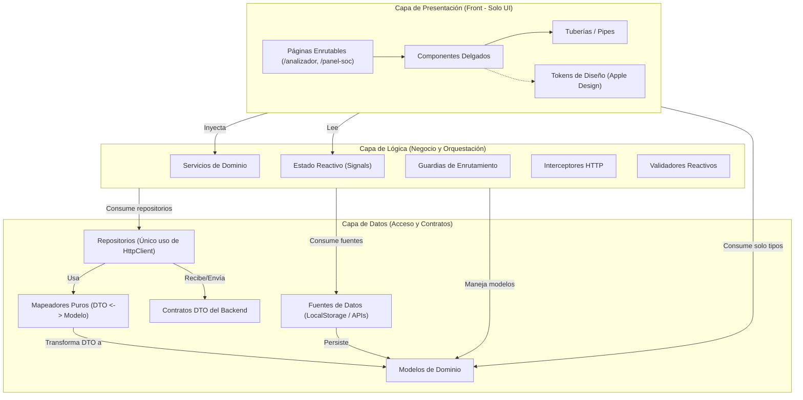

# 🏛️ Arquitectura del Sistema: PhishShield Angular

Este documento describe la arquitectura modular por capas desacopladas implementada en **PhishShield**, siguiendo el estándar de separación estricta de responsabilidades, componentes standalone, reactividad basada en *Signals* y diseño de interfaz física *Apple Design*.

---

## 1. Diagrama de Capas y Flujo de Dependencias

---

## 2. Reglas de Dependencia Estrictas

1. **Capa de Presentación (`src/app/presentacion/`):**
   - **Regla:** Solo puede importar de `logica/` y de los contratos de tipo en `datos/modelos/`.
   - **Prohibición:** No puede importar repositorios, DTOs, mapeadores, fuentes ni `@angular/common/http`.
   - **Responsabilidad:** Renderizado visual, captura de eventos de usuario, animaciones de resorte y estados de carga. Los componentes son delgados: no contienen lógica de negocio ni manipulan llamadas de red directas.
2. **Capa de Lógica (`src/app/logica/`):**
   - **Regla:** Solo puede importar de `datos/` y utilidades de Angular.
   - **Prohibición:** Nunca importa de `presentacion/`.
   - **Responsabilidad:** Orquestación de casos de uso, evaluación de reglas de heurística de consejos, validación de contraseñas de 4 factores, estado reactivo mediante Signals (`signal()`, `computed()`), autenticación e interceptores.
3. **Capa de Datos (`src/app/datos/`):**
   - **Regla:** Es la base del sistema y no depende de ninguna otra capa de la aplicación.
   - **Prohibición:** Nunca importa de `presentacion/` ni de `logica/`.
   - **Responsabilidad:** Contratos de API (DTOs), modelos puros de dominio, fuentes de almacenamiento seguro y repositorios (`HttpClient`).

> [!NOTE]
> Estas fronteras son verificadas y forzadas automáticamente en tiempo de compilación por **ESLint** mediante la regla `no-restricted-imports` en `eslint.config.js`.

---

## 3. Convenciones de Nombrado en Español

Todas las entidades creadas en el proyecto adoptan una nomenclatura homogénea en español:

| Tipo de Elemento | Convención | Ejemplo en el Proyecto |
| :--- | :--- | :--- |
| **Archivos y Carpetas** | `kebab-case` con sufijo de tipo | `analisis.servicio.ts`, `tarjeta-veredicto.componente.ts` |
| **Clases e Interfaces** | `PascalCase` en español | `ResultadoAnalisis`, `AnalisisRepositorio`, `SesionEstado` |
| **Variables y Funciones** | `camelCase` en español | `estaCargando`, `analizarUrl()`, `obtenerHistorial()` |
| **Constantes** | `MAYUSCULAS_CON_GUION_BAJO` | `CLAVE_ALMACENAMIENTO_TOKEN`, `ENTORNO` |
| **Selectores de Componente**| `app-` seguido de `kebab-case` | `app-tarjeta-veredicto`, `app-barra-busqueda` |
| **Rutas (URL paths)** | En español en minúsculas | `/analizador`, `/panel-soc` |

### Excepciones Permitidas (Reservadas)
- Funciones y decoradores nativos del framework: `@Component`, `inject()`, `signal()`, `computed()`, `HttpClient`, `RouterOutlet`, `CanActivateFn`.
- Propiedades requeridas por bibliotecas externas o métodos del navegador (`window.localStorage`, `addEventListener`, `btoa`, `JSON.stringify`).
- Nombres de campos de APIs remotas (aislados estrictamente en `datos/dto/`).

---

## 4. Principios de Apple Design Aplicados en el Frontend

La capa de presentación incorpora las directrices de diseño físico e interfaces fluidas de Apple:

1. **Materiales Translúcidos y Profundidad:**
   - Efecto de cristal esmerilado continuo con `backdrop-filter: blur(20px) saturate(180%)`.
   - Bordes de material reactivos a la iluminación (`rgba(255, 255, 255, 0.4)` en modo claro y `rgba(255, 255, 255, 0.12)` en modo oscuro).
2. **Microinteracciones y Feedback Inmediato:**
   - Retroalimentación háptica/visual instantánea en eventos táctiles y pulsación (`:active { transform: scale(0.97); }`).
3. **Física de Resortes Críticamente Amortiguados:**
   - Transiciones modeladas mediante resortes (`cubic-bezier(0.16, 1, 0.3, 1)`) que previenen oscilaciones molestas y garantizan respuesta inmediata.
4. **Tipografía Óptica:**
   - Fuente del sistema (`-apple-system`, `SF Pro Display`, `system-ui`).
   - *Tracking* óptico: espaciado negativo (`-0.02em`) en titulares grandes y neutro en cuerpo.
5. **Accesibilidad e Inclusividad:**
   - Soporte total de `@media (prefers-reduced-motion: reduce)` (sustituyendo traslaciones por disolvencias).
   - Soporte para `@media (prefers-reduced-transparency: reduce)`.
   - Contraste WCAG AAA/AA y foco visible en todos los elementos interactivos.

---

## 5. Guía para Agregar una Nueva Funcionalidad

Para incorporar un nuevo caso de uso (por ejemplo, *Lista Blanca de Dominios Corporativos*):

### Paso 1: Capa de Datos
1. Definir los contratos DTO en `datos/dto/lista-blanca.dto.ts`.
2. Crear la interfaz de dominio pura en `datos/modelos/lista-blanca.modelo.ts`.
3. Crear el mapeador puro en `datos/mapeadores/lista-blanca.mapeador.ts`.
4. Implementar las llamadas HTTP en `datos/repositorios/lista-blanca.repositorio.ts`.

### Paso 2: Capa de Lógica
1. Crear el servicio de orquestación en `logica/servicios/lista-blanca.servicio.ts`.
2. Exponer señales reactivas (`signal`, `computed`) para el estado de carga y elementos.
3. Si requiere validación de entrada, crear `logica/validadores/dominio.validador.ts`.

### Paso 3: Capa de Presentación
1. Crear componentes delgados en `presentacion/componentes/tarjeta-lista-blanca/`.
2. Enlazar los inputs y outputs hacia las señales y métodos del servicio en la página correspondiente.
3. Aplicar los tokens de `presentacion/diseno/tokens.scss` para garantizar coherencia visual.
