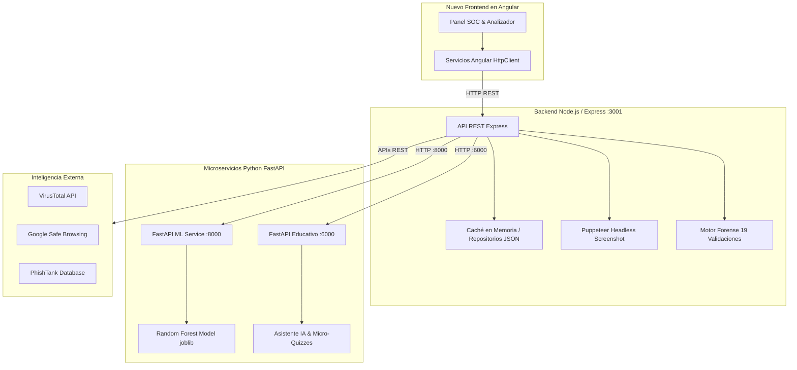

# 🛡️ Guía Maestra de Migración: PhishShield a Angular

Este documento contiene la **especificación técnica integral, contratos de API, variables de entorno, modelos de datos, servicios y componentes** necesarios para reconstruir y migrar el frontend de **PhishShield** a un proyecto moderno en **Angular (v17/v18+)** con componentes Standalone y TypeScript.

---

## 📑 Tabla de Contenidos
1. [Visión General del Sistema y Arquitectura Destino](#1-visión-general-del-sistema-y-arquitectura-destino)
2. [Variables de Entorno y Configuración](#2-variables-de-entorno-y-configuración)
3. [Estructura del Proyecto en Angular](#3-estructura-del-proyecto-en-angular)
4. [Contratos de API y Endpoints de Microservicios](#4-contratos-de-api-y-endpoints-de-microservicios)
5. [Interfaces y Modelos de Datos en TypeScript](#5-interfaces-y-modelos-de-datos-en-typescript)
6. [Servicios Angular a Implementar](#6-servicios-angular-a-implementar)
7. [Componentes Clave de la Interfaz (UI/UX)](#7-componentes-clave-de-la-interfaz-uiux)
8. [Lógica de Negocio, Heurísticas y Regla de Piso](#8-lógica-de-negocio-heurísticas-y-regla-de-piso)
9. [Guía de Arranque Rápido Paso a Paso](#9-guía-de-arranque-rápido-paso-a-paso)

---

## 1. Visión General del Sistema y Arquitectura Destino

PhishShield opera como una plataforma desacoplada orientada a la ciberseguridad:



* **Frontend Angular:** Consume la API Express de Node.js mediante `HttpClient`. Gestiona estados reactivos (`Signals` o `RxJS BehaviorSubjects`), enrutamiento de vistas y diseño responsivo para analistas SOC.
* **Backend Node/Express (Puerto 3001):** Orquesta los análisis, ejecuta Puppeteer para screenshots, coordina las fuentes externas y persiste auditoría.
* **Microservicio ML (Puerto 8000):** Inferencia rápida de Random Forest (15 features + Entropía de Shannon).
* **Microservicio Educativo (Puerto 6000):** Generador de explicaciones adaptativas y micro-quizzes pedagógicos.

---

## 2. Variables de Entorno y Configuración

### 2.1 Backend Node.js (`.env`)
Guarda este archivo en la raíz del backend (`phishshield1/.env` o `backend/.env`):

```ini
# ============================================
# PhishShield — Variables de Entorno de Servidor
# ============================================

# Puerto del Servidor Web Express
PORT=3001

# URL del Microservicio de Machine Learning (FastAPI)
ML_SERVICE_URL=http://localhost:8000

# URL del Microservicio Educativo Asistido por IA (FastAPI)
EDUCATIONAL_SERVICE_URL=http://localhost:6000

# Credenciales de Administrador para Panel SOC
ADMIN_USERNAME=admin
ADMIN_PASSWORD=Windows12@

# APIs de Inteligencia de Amenazas (Opcionales para enriquecimiento)
VIRUSTOTAL_API_KEY=tu_api_key_virustotal_aqui
GOOGLE_SAFE_BROWSING_API_KEY=tu_api_key_google_safebrowsing_aqui
GEMINI_API_KEY=tu_api_key_gemini_aqui
OPENAI_API_KEY=tu_api_key_openai_aqui
```

### 2.2 Frontend Angular (`src/environments/environment.ts`)

```typescript
// src/environments/environment.development.ts
export const environment = {
  production: false,
  apiUrl: 'http://localhost:3001',
  mlApiUrl: 'http://localhost:8000',
  eduApiUrl: 'http://localhost:6000',
  appName: 'PhishShield — Panel SOC',
  version: '2.0.0'
};
```

```typescript
// src/environments/environment.ts (Producción)
export const environment = {
  production: true,
  apiUrl: 'https://api.tudominio.com',
  mlApiUrl: 'https://ml.tudominio.com',
  eduApiUrl: 'https://edu.tudominio.com',
  appName: 'PhishShield — Panel SOC',
  version: '2.0.0'
};
```

---

## 3. Estructura del Proyecto en Angular

Se sugiere una arquitectura modular basada en **Standalone Components**, orientada a características (*Feature-driven*):

```text
src/app/
├── core/                           # Servicios singleton, interceptores, guards
│   ├── guards/
│   │   └── admin-auth.guard.ts     # Protege rutas /admin con Token
│   ├── interceptors/
│   │   ├── auth.interceptor.ts     # Inyecta Bearer token en rutas administrativas
│   │   └── error.interceptor.ts    # Captura errores globales HTTP
│   └── services/
│       ├── auth.service.ts         # Login, logout, gestión de token y sesión
│       └── tema.service.ts         # Control de Modo Oscuro / Claro
├── features/                       # Módulos de funcionalidad del negocio
│   ├── analizador/                 # Vista pública principal
│   │   ├── components/
│   │   │   ├── barra-busqueda/     # Input reactivo con validaciones URL
│   │   │   ├── veredicto-card/     # Badge de riesgo, score circular y factores
│   │   │   ├── preview-screenshot/ # Visor de captura con estado de carga
│   │   │   ├── asistente-ia/       # Explicación educativa adaptativa
│   │   │   ├── micro-quiz/         # Preguntas interactivas con feedback visual
│   │   │   └── desglose-tecnico/   # Acordeón de 19 validaciones forenses
│   │   └── analizador.component.ts # Vista contenedora
│   ├── admin-soc/                  # Panel privado del SOC
│   │   ├── components/
│   │   │   ├── metricas-kpi/       # Tarjetas de contadores (total, phishing, limpias)
│   │   │   ├── tabla-historial/    # Histórico de análisis con paginación y filtros
│   │   │   └── modal-falsos-pos/   # Diálogo para dar de baja reportes
│   │   └── admin-soc.component.ts  # Vista del panel SOC
│   └── auth/
│       └── login-dialog/           # Modal de inicio de sesión de administrador
├── shared/                         # Componentes, pipes y directivas reutilizables
│   ├── components/
│   │   ├── header/                 # Barra superior con logo, toggle de tema y acceso admin
│   │   ├── footer/                 # Descargos de responsabilidad y versión
│   │   └── spinner/                # Indicador de carga animado
│   └── pipes/
│       └── riesgo-color.pipe.ts    # Transforma 'ALTO'|'MEDIO'|'BAJO' a clase CSS
├── models/                         # Interfaces TypeScript (Contratos)
│   ├── analisis.model.ts
│   ├── asistente-ia.model.ts
│   ├── historial.model.ts
│   └── admin.model.ts
└── app.routes.ts                   # Enrutamiento de la aplicación
```

---

## 4. Contratos de API y Endpoints de Microservicios

### 4.1 Backend Orquestador Node.js (`http://localhost:3001`)

#### 1. `POST /analizar` — Ejecución del Análisis Forense Completo
* **Descripción:** Recibe una URL, comprueba la caché, invoca en paralelo las validaciones heurísticas, el modelo ML, la captura DOM y genera la explicación didáctica.
* **Headers:** `Content-Type: application/json`
* **Request Body:**
  ```json
  {
    "url": "https://bancolombia-login-seguro.xyz/portal"
  }
  ```
* **Response `200 OK`:**
  ```json
  {
    "url": "https://bancolombia-login-seguro.xyz/portal",
    "riesgo": "ALTO",
    "puntuacion": 24,
    "probabilidad_ml": 0.985,
    "indicadores": [
      "Distancia Levenshtein sospechosa con bancolombia.com (distancia: 1)",
      "Uso de TLD de bajo costo sospechoso (.xyz)",
      "Presencia de subdominios y guiones concatenados",
      "Certificado SSL emitido hace menos de 7 días (Free SSL CA)",
      "Formulario DOM detectado solicitando 'password' y 'cedula'"
    ],
    "factores_puntuacion": {
      "base": 0,
      "typosquatting": 8,
      "ml_ponderado": 9.85,
      "ssl_sospechoso": 4,
      "dom_credenciales": 4,
      "score_floor_aplicado": false
    },
    "inspeccion_ssl": {
      "valido": true,
      "emisor": "Let's Encrypt",
      "dias_antiguedad": 2,
      "es_reciente": true
    },
    "inspeccion_dom": {
      "tiene_formulario_login": true,
      "campos_sensibles": ["cedula", "clave_virtual"]
    },
    "asistente_ia": {
      "explicacion": "Este enlace utiliza técnicas de typosquatting y suplantación de identidad bancaria...",
      "recomendacion": "No ingrese sus credenciales bancarias. Verifique siempre el dominio principal.",
      "cuestionario": [
        {
          "pregunta": "¿Por qué el dominio 'bancolombia-login-seguro.xyz' es sospechoso?",
          "opciones": [
            "Porque utiliza cifrado HTTPS",
            "Porque añade palabras como 'login-seguro' y cambia el TLD oficial a .xyz",
            "Porque carga rápido",
            "Porque no contiene números"
          ],
          "respuesta_correcta": 1
        }
      ]
    },
    "timestamp": "2026-10-07T22:30:00.000Z"
  }
  ```

#### 2. `POST /reportar` — Reporte Manual de Phishing
* **Request:** `{ "url": "https://sitio-malicioso.com" }`
* **Response `200 OK`:** `{ "success": true, "mensaje": "URL reportada correctamente" }`

#### 3. `GET /estadisticas` — Métricas Globales del SOC
* **Response `200 OK`:**
  ```json
  {
    "total_analizados": 1420,
    "riesgo_alto": 412,
    "riesgo_medio": 185,
    "riesgo_bajo": 823,
    "reportes_comunidad": 64
  }
  ```

#### 4. `GET /historial` — Últimos Análisis Realizados
* **Response `200 OK`:** Array de objetos tipo `IHistorialItem` (últimos 50 registros).

#### 5. `GET /api/screenshot?url=<URL_ENCODED>` — Captura de Pantalla Headless
* **Descripción:** Genera o retorna en streaming un buffer de imagen `image/jpeg` obtenido con Puppeteer.

#### 6. Endpoints Administrativos (Requieren Header `Authorization: Bearer <TOKEN>`):
* `POST /api/login` $\to$ Body: `{ "username": "admin", "password": "..." }` $\to$ `{ "success": true, "token": "..." }`
* `GET /api/admin/export/reportes` $\to$ Retorna JSON con lista de reportes manuales.
* `GET /api/admin/export/historial` $\to$ Retorna JSON con historial completo para auditoría SOC.
* `DELETE /api/admin/reportar` $\to$ Body: `{ "dominio": "ejemplo.com" }` (Elimina falso positivo).
* `POST /api/admin/change-password` $\to$ Body: `{ "oldPassword": "...", "newPassword": "..." }`.

---

### 4.2 Microservicio ML Python (`http://localhost:8000`)
* `POST /predict`
  * **Input JSON:**
    ```json
    {
      "features": [4.32, 2, 45, 12, 1, 0, 0, 1, 0, 1, 0, 1, 0, 0, 0, 4.85]
    }
    ```
  * **Output JSON:**
    ```json
    {
      "prediction": 1,
      "probability": 0.985
    }
    ```
* `GET /health` $\to$ `{"status": "ok", "model_loaded": true}`

---

### 4.3 Microservicio Educativo IA (`http://localhost:6000`)
* `POST /explicar`
  * **Input JSON:**
    ```json
    {
      "url": "https://...",
      "score": 24,
      "riskLevel": "ALTO",
      "features": { "entropia": 4.85, "subdominios": 3 },
      "details": ["Typosquatting detectado", "SSL reciente"]
    }
    ```
  * **Output JSON:**
    ```json
    {
      "explicacion": "Análisis pedagógico...",
      "cuestionario": [
        {
          "pregunta": "¿Qué indica la alta entropía?",
          "opciones": ["A", "B", "C", "D"],
          "indice_correcto": 1
        }
      ]
    }
    ```
* `GET /salud` $\to$ `{"estado": "operativo"}`

---

## 5. Interfaces y Modelos de Datos en TypeScript

Guarda estos contratos en `src/app/models/`:

### `src/app/models/analisis.model.ts`
```typescript
export type NivelRiesgo = 'ALTO' | 'MEDIO' | 'BAJO';

export interface ISolicitudAnalisis {
  url: string;
}

export interface IInspeccionSsl {
  valido: boolean;
  emisor?: string;
  dias_antiguedad?: number;
  es_reciente?: boolean;
}

export interface IInspeccionDom {
  tiene_formulario_login?: boolean;
  campos_sensibles?: string[];
}

export interface IFactoresPuntuacion {
  base: number;
  typosquatting: number;
  ml_ponderado: number;
  ssl_sospechoso: number;
  dom_credenciales: number;
  score_floor_aplicado: boolean;
}

export interface IItemQuiz {
  pregunta: string;
  opciones: string[];
  respuesta_correcta: number; // Índice 0-3
}

export interface IAsistenteIa {
  explicacion: string;
  recomendacion: string;
  cuestionario?: IItemQuiz[];
}

export interface IResultadoAnalisis {
  url: string;
  riesgo: NivelRiesgo;
  puntuacion: number;
  probabilidad_ml?: number | null;
  indicadores: string[];
  factores_puntuacion?: IFactoresPuntuacion;
  inspeccion_ssl?: IInspeccionSsl;
  inspeccion_dom?: IInspeccionDom;
  asistente_ia?: IAsistenteIa;
  timestamp: string;
}

export interface IEstadisticasSoc {
  total_analizados: number;
  riesgo_alto: number;
  riesgo_medio: number;
  riesgo_bajo: number;
  reportes_comunidad: number;
}
```

### `src/app/models/admin.model.ts`
```typescript
export interface ILoginRequest {
  username: string;
  password: string;
}

export interface ILoginResponse {
  success: boolean;
  token?: string;
  error?: string;
}

export interface IHistorialItem {
  id?: string;
  url: string;
  riesgo: 'ALTO' | 'MEDIO' | 'BAJO';
  puntuacion: number;
  timestamp: string;
}
```

---

## 6. Servicios Angular a Implementar

### 6.1 `AnalisisService` (`src/app/core/services/analisis.service.ts`)

```typescript
import { Injectable, inject } from '@angular/core';
import { HttpClient } from '@angular/common/http';
import { Observable } from 'rxjs';
import { environment } from '../../../environments/environment';
import { IResultadoAnalisis, IEstadisticasSoc, IHistorialItem } from '../../models/analisis.model';

@Injectable({
  providedIn: 'root'
})
export class AnalisisService {
  private http = inject(HttpClient);
  private apiUrl = environment.apiUrl;

  analizarUrl(url: string): Observable<IResultadoAnalisis> {
    return this.http.post<IResultadoAnalisis>(`${this.apiUrl}/analizar`, { url });
  }

  reportarUrl(url: string): Observable<{ success: boolean; mensaje: string }> {
    return this.http.post<{ success: boolean; mensaje: string }>(`${this.apiUrl}/reportar`, { url });
  }

  obtenerEstadisticas(): Observable<IEstadisticasSoc> {
    return this.http.get<IEstadisticasSoc>(`${this.apiUrl}/estadisticas`);
  }

  obtenerHistorial(): Observable<IHistorialItem[]> {
    return this.http.get<IHistorialItem[]>(`${this.apiUrl}/historial`);
  }

  obtenerUrlCaptura(url: string): string {
    return `${this.apiUrl}/api/screenshot?url=${encodeURIComponent(url)}`;
  }
}
```

### 6.2 `AuthService` (`src/app/core/services/auth.service.ts`)

```typescript
import { Injectable, inject, signal } from '@angular/core';
import { HttpClient } from '@angular/common/http';
import { Observable, tap } from 'rxjs';
import { environment } from '../../../environments/environment';
import { ILoginRequest, ILoginResponse } from '../../models/admin.model';

@Injectable({
  providedIn: 'root'
})
export class AuthService {
  private http = inject(HttpClient);
  private apiUrl = environment.apiUrl;
  private tokenKey = 'phishshield_admin_token';

  token = signal<string | null>(localStorage.getItem(this.tokenKey));
  estaAutenticado = signal<boolean>(!!localStorage.getItem(this.tokenKey));

  login(credenciales: ILoginRequest): Observable<ILoginResponse> {
    return this.http.post<ILoginResponse>(`${this.apiUrl}/api/login`, credenciales).pipe(
      tap((res) => {
        if (res.success && res.token) {
          localStorage.setItem(this.tokenKey, res.token);
          this.token.set(res.token);
          this.estaAutenticado.set(true);
        }
      })
    );
  }

  logout(): void {
    localStorage.removeItem(this.tokenKey);
    this.token.set(null);
    this.estaAutenticado.set(false);
  }
}
```

---

## 7. Componentes Clave de la Interfaz (UI/UX)

### 7.1 Componente: Analizador de URL (`analizador.component.ts`)
```typescript
import { Component, inject, signal } from '@angular/core';
import { CommonModule } from '@angular/common';
import { FormsModule } from '@angular/forms';
import { AnalisisService } from '../../core/services/analisis.service';
import { IResultadoAnalisis } from '../../models/analisis.model';
import { VeredictoCardComponent } from './components/veredicto-card/veredicto-card.component';
import { AsistenteIaComponent } from './components/asistente-ia/asistente-ia.component';
import { MicroQuizComponent } from './components/micro-quiz/micro-quiz.component';

@Component({
  selector: 'app-analizador',
  standalone: true,
  imports: [CommonModule, FormsModule, VeredictoCardComponent, AsistenteIaComponent, MicroQuizComponent],
  template: `
    <div class="max-w-4xl mx-auto p-6 space-y-6">
      <header class="text-center space-y-2">
        <h1 class="text-3xl font-extrabold text-slate-900 dark:text-white flex items-center justify-center gap-2">
          🛡️ PhishShield — Verificador de URLs
        </h1>
        <p class="text-slate-600 dark:text-slate-400">
          Evaluación técnica multicapa asistida por Machine Learning y análisis forense.
        </p>
      </header>

      <!-- Barra de Entrada -->
      <div class="flex gap-2">
        <input
          [(ngModel)]="urlInput"
          type="url"
          placeholder="https://ejemplo-banco-seguro.com/login"
          class="flex-1 px-4 py-3 border rounded-xl dark:bg-slate-800 dark:text-white"
        />
        <button
          (click)="ejecutarAnalisis()"
          [disabled]="cargando()"
          class="bg-blue-600 hover:bg-blue-700 text-white font-semibold px-6 py-3 rounded-xl transition"
        >
          {{ cargando() ? 'Analizando...' : '🔍 Analizar' }}
        </button>
      </div>

      <!-- Resultados -->
      @if (resultado()) {
        <app-veredicto-card [resultado]="resultado()!" />
        @if (resultado()!.asistente_ia) {
          <app-asistente-ia [asistente]="resultado()!.asistente_ia!" />
          @if (resultado()!.asistente_ia!.cuestionario?.length) {
            <app-micro-quiz [preguntas]="resultado()!.asistente_ia!.cuestionario!" />
          }
        }
      }
    </div>
  `
})
export class AnalizadorComponent {
  private analisisService = inject(AnalisisService);

  urlInput = '';
  cargando = signal<boolean>(false);
  resultado = signal<IResultadoAnalisis | null>(null);

  ejecutarAnalisis(): void {
    if (!this.urlInput) return;
    this.cargando.set(true);
    this.analisisService.analizarUrl(this.urlInput).subscribe({
      next: (data) => {
        this.resultado.set(data);
        this.cargando.set(false);
      },
      error: (err) => {
        alert('Error al analizar la URL: ' + (err.error?.error || err.message));
        this.cargando.set(false);
      }
    });
  }
}
```

---

## 8. Lógica de Negocio, Heurísticas y Regla de Piso

Al implementar la lógica de presentación o si creas un BFF (Backend For Frontend) en TypeScript/Node:

1. **Las 19 Validaciones Técnicas:**
   * Estructura URL (Protocolo, longitud > 100, dominio > 63).
   * Typosquatting (Levenshtein $\le 2$ contra marcas legítimas registradas).
   * Homógrafos Unicode / Punycode (`xn--` o caracteres cirílicos).
   * Detección de IP directa en hostname.
   * Conteo de subdominios ($> 2$).
   * Guiones múltiples ($> 2$).
   * Números en el dominio.
   * Parámetros sensibles (`pass`, `pwd`, `token`, `clave`, etc.).
   * Cantidad de parámetros en query ($> 5$).
   * Longitud de la ruta ($> 50$).
   * Cadena de redirecciones encadenadas ($\ge 3$).
   * Inspección SSL/TLS (Certificado autofirmado, expirado o de $< 30$ días).
   * Reputación externa (SafeBrowsing, VirusTotal, PhishTank).
   * Emulación DOM Headless (Puppeteer inspeccionando campos `<input type="password">`).
   * Entropía de Shannon del hostname ($> 4.5$ bits indica probable DGA).

2. **La Regla de Piso (`Score Floor`):**
   * Si la puntuación forense preliminar es baja ($< 5$), pero la probabilidad del modelo Random Forest predice un valor crítico ($\ge 0.5$ o $50\%$), la puntuación total se eleva automáticamente a un piso de seguridad para evitar clasificar un ataque de día cero como "BAJO".

---

## 9. Guía de Arranque Rápido Paso a Paso

### Paso 1: Crear el nuevo proyecto Angular
```bash
# Instalar Angular CLI global si no lo tienes
npm install -g @angular/cli

# Crear nuevo proyecto con componentes Standalone y CSS moderno
ng new phishshield-angular --routing --style=css --standalone --ssr=false
cd phishshield-angular
```

### Paso 2: Instalar dependencias recomendadas
```bash
# Utilidades de gráficos para el panel SOC
npm install chart.js ng2-charts

# Opcional: Iconografía moderna
npm install lucide-angular
```

### Paso 3: Configurar variables de entorno en Angular
Genera los entornos con el comando oficial:
```bash
ng g environments
```
Copia las variables descritas en la **Sección 2.2** en `src/environments/environment.ts`.

### Paso 4: Levantar los servicios existentes
1. En una terminal, mantén corriendo el Backend Node.js:
   ```bash
   cd phishshield1
   npm start
   ```
2. En otra terminal, levanta el Microservicio de ML:
   ```bash
   cd server/ml_service
   uvicorn main:app --port 8000
   ```
3. En la terminal del nuevo proyecto Angular:
   ```bash
   npm start
   ```
   Abre **[http://localhost:4200](http://localhost:4200)**. ¡Tu nuevo cliente en Angular estará completamente conectado al ecosistema PhishShield!
